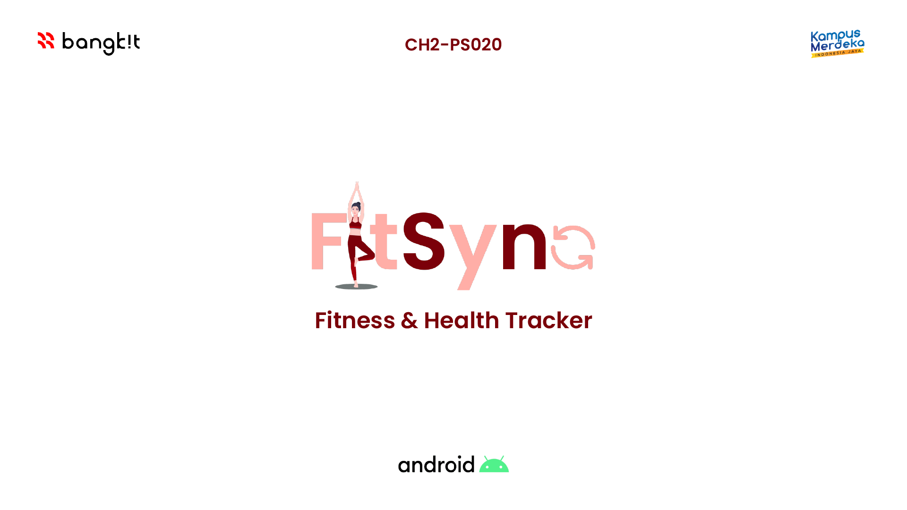
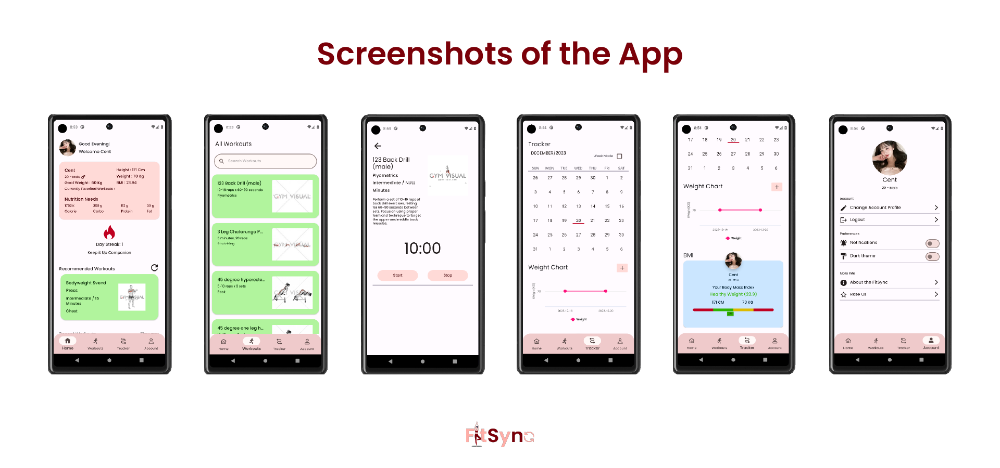

# FitSync @ Bangkit 2023 Batch 2

In a world increasingly challenged by health issues, our team is committed to addressing the core problem of personal well-being. We are thrilled to introduce FitSync, a state-of-the-art fitness and nutrition tracker application that aims to empower individuals to take control of their health and transform their lives. The modern lifestyle has led to a surge in health concerns, including obesity, chronic diseases, and inadequate nutrition. People struggle to manage their fitness and dietary needs effectively, requiring a comprehensive solution to track, plan, and optimize their well-being.

FitSync combines cutting-edge technology with comprehensive fitness tracking, personalized dietary nutrition recommendations, creating a holistic platform for users. Our goal is to contribute to the global drive for healthier living, making it accessible, enjoyable, and sustainable for everyone in an ecosystem that empowers users to embark on their wellness journey with confidence and conviction. In today's fast-paced world, health often takes a back seat to the demands of daily life. FitSync is designed to address this fundamental issue by offering a dynamic and user-centric solution.

## Get It Now!

    
    &nbsp;
    

## Team Members

<table>
    <thead>
        <tr>
            <th>Name</th>
            <th>Bangkit-ID</th>
            <th>Socials</th>
        </tr>
    </thead>
    <tbody>
        <tr>
            <td>Darrel Cyril Gunawan</td>
            <td>M108BSY1617</td>
            <td style="text-align: center;">
                
                
            </td>
        </tr>
        <tr>
            <td>Nigel Kusdenata</td>
            <td>M108BSY1102</td>
            <td style="text-align: center;">
                
                
            </td>
        </tr>
        <tr>
            <td>Steven Tribethran</td>
            <td>M694BSY0582</td>
            <td style="text-align: center;">
                
                
            </td>
        </tr>
        <tr>
            <td>Alida Shidqiya Naifa Ulmulikhun</td>
            <td>C248BSX4205</td>
            <td style="text-align: center;">
                
                
            </td>
        </tr>
        <tr>
            <td>Muhammad Alfayed Dennita</td>
            <td>C134BSY3479</td>
            <td style="text-align: center;">
                
                
            </td>
        </tr>
        <tr>
            <td>Vincent</td>
            <td>A694BSY2946</td>
            <td style="text-align: center;">
                
                
            </td>
        </tr>
        <tr>
            <td>Hidayat</td>
            <td>A550BKY4421</td>
            <td style="text-align: center;">
                
                
            </td>
        </tr>
    </tbody>
</table>
